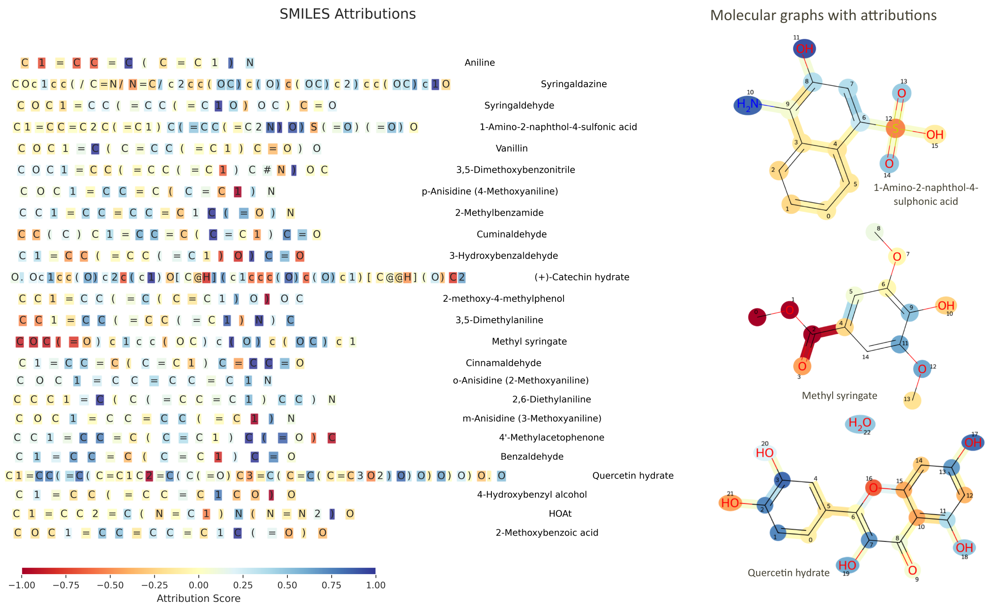

## Prediction of laccase-catalyzed oxidation of aromatic substrates using machine learning

The repository contains accompanying code to the paper "Prediction of laccase-catalyzed oxidation of aromatic
substrates using machine learning" by Y. Kulagina, C. Goldhahn, R. Weishaupt, and M. Schubert.


### Abstract
Laccases are multi-copper oxidase enzymes capable of oxidizing a broad spectrum of aromatic and
non-aromatic compounds, using molecular oxygen and producing only water as a byproduct. This
environmentally benign mechanism makes laccases attractive candidates for green catalysis across
biotechnological, industrial, and environmental domains. However, the ability of laccases to oxidize
specific substrates is governed by a complex interplay of molecular structure, enzyme properties,
redox potential, and environmental context -- making accurate prediction of substrate-laccase compatibility
a persistent challenge. To address this, we leverage machine learning (ML) models to
pre-screen substrate-laccase combinations, thereby streamlining experimental efforts. In this study,
we evaluate five classification algorithms -- logistic regression with elastic net regularization, support
vector machines, random forests, gradient-boosted decision trees, and a ChemBERTa-based
transformer model -- using three in-house curated datasets of aromatic substrates and their oxidation
profiles across distinct laccases. While the computational methods are well established, the originality
and domain specificity of the datasets enable a nuanced assessment of predictive performance. Our
results show that gradient-boosted trees consistently outperform other classifiers in both discrimination
and generalization tasks. Further interpretability analyses using feature importance (RFC) and
attention mechanisms (ChemBERTa) reveal key molecular features influencing predictive outcomes.
These findings provide valuable insights for accelerating laccase-substrate discovery using data-driven
tools.

The repository comprises 3 folders: 
* **transformer** - contains the code for fine-tuning the ChemBERTa model for the classification task.
* **classical** - contains the code for training logistic regression with elastic net regularization, SVM, RF and GB classifiers for the laccase-madiated oxidation prediction.
* **assets** - contains relevant images, graphics, notes, etc.



### Data

The datasets are available via a Zenodo link:
10.5281/zenodo.15728331

### Installation and Usage

Create the environment with the dependencies listed in the `requirements.txt`, which will be used as the kernel for running the interactive python notebooks `lac-classic.ipynb` (classical classifiers) and `lac-transformer.ipynb` (ChemBERTa model). 

* `lac-classic.ipynb` does not requie GPU; 
* `lac-transformer.ipynb` assums that a user has an access to one GPU. 

```bash
conda --verion 
conda 22.9.0 
```

### License
This project is primarily licensed under the GNU Lesser General Public License v3.0. Note that the software is provided "as is", without warranty of any kind, express or implied. If you use the code or data, please cite us.

